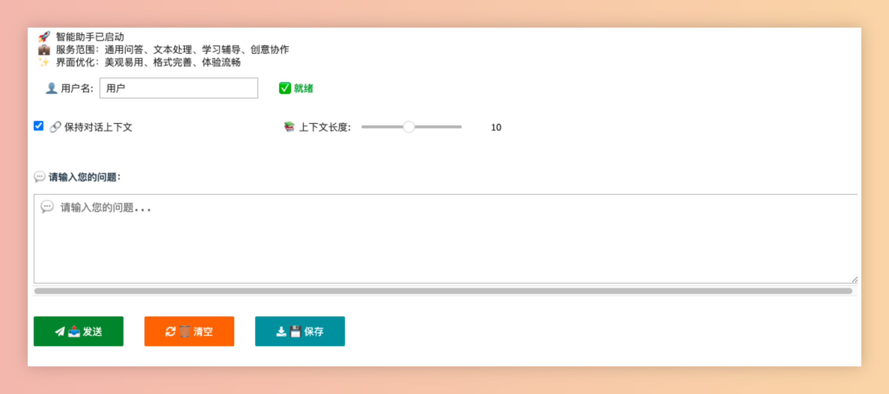

# 🤖 Jupyter 智能助手聊天机器人

一个基于 Jupyter Notebook 的专业 AI 智能助手，具有优雅的用户界面和完善的对话功能。

## 🌟 功能特性

### 核心功能
- **🤖 通用智能助手**: 能够回答各种领域的问题和提供多样化服务
- **💬 智能对话**: 支持上下文连续对话和历史记录管理
- **🎨 美观界面**: 现代化的用户界面设计，提升用户体验
- **📝 格式优化**: 完美支持 markdown、代码等内容的格式化显示

### 高级功能
- **📊 数据导出**: 支持 Markdown 和 JSON 格式的对话历史导出
- **📈 统计分析**: 实时查看对话量、用户活跃度等关键指标
- **🔧 界面控制**: 支持代码显示/隐藏切换
- **⚙️ 上下文管理**: 可配置的对话上下文长度和保持策略

### 服务能力
- 💡 **知识问答**: 回答各领域的专业问题和常识性问题
- 📝 **文本处理**: 写作、翻译、总结、分析等文本相关任务
- 🔧 **问题解决**: 提供解决方案、建议和指导
- 📚 **学习辅导**: 协助学习、解释概念、提供教学支持
- 🎨 **创意协作**: 头脑风暴、创意生成、方案设计
- 🌐 **多领域咨询**: 跨领域的专业咨询服务

# 🎨 界面效果




## 🚀 快速开始

### 环境要求
- Python 3.7+
- Jupyter Notebook 或 JupyterLab
- OpenAI API 密钥

### 安装依赖
项目会自动安装所需依赖，包括：
- `ipywidgets` - Jupyter 交互式组件
- `openai` - OpenAI API 客户端
- `markdown` - Markdown 处理

### 配置步骤

1. **克隆项目**
   ```bash
   git clone <repository-url>
   cd jupyter-chatbot
   ```

2. **启动 Jupyter Notebook**
   ```bash
   jupyter notebook
   ```

3. **打开 chatbot.ipynb**
   在浏览器中打开 `chatbot.ipynb` 文件

4. **配置 API 密钥**
   在第三个代码单元格中配置您的 OpenAI API 信息：
   ```python
   OPENAI_API_KEY = "your-openai-api-key-here"  # 替换为您的实际API密钥
   MODEL_NAME = "gpt-4"  # 可选择: gpt-3.5-turbo, gpt-4, gpt-4-turbo 等
   BASE_URL = "xxxx"  # 如果使用自定义端点，请配置此项
   ```

5. **运行所有单元格**
   按顺序执行所有代码单元格，启动聊天机器人

## 📖 使用说明

### 基本操作
1. **开始对话**: 在文本框中输入您的问题
2. **发送消息**: 点击"📤 发送"按钮或使用快捷键
3. **查看回复**: AI 助手的回复会以优雅的格式显示在对话区域

### 界面控制
- **🔧 显示/隐藏代码**: 点击按钮切换代码单元格的显示状态
- **👤 用户名设置**: 可以自定义用户名，默认为"用户"
- **🔗 上下文管理**: 可以开启/关闭对话上下文保持功能

### 对话管理
- **🗑️ 清空对话**: 清除当前所有对话历史
- **💾 保存对话**: 将对话历史保存为 Markdown 文件
- **📊 导出 JSON**: 导出包含统计信息的 JSON 格式数据
- **📈 查看统计**: 显示对话统计分析信息

### 高级设置
- **📚 上下文长度**: 调整保持的历史对话数量（1-20条）
- **🔗 上下文开关**: 控制是否保持对话的连续性

## 🎨 界面特色

### 视觉设计
- **渐变背景**: 美观的渐变色彩搭配
- **圆角设计**: 现代化的圆角边框
- **阴影效果**: 立体感的阴影设计
- **响应式布局**: 适配不同屏幕尺寸

### 消息格式化
- **Markdown 支持**: 完整的 Markdown 语法支持
- **代码高亮**: 代码块的语法高亮显示
- **列表格式**: 有序和无序列表的美观显示
- **文本样式**: 粗体、斜体等文本格式

## 📊 数据导出格式

### Markdown 格式
```markdown
# 🤖 AI助手对话历史

**生成时间:** 2024-01-01 12:00:00
**总对话次数:** 10

---

## 📋 对话记录 1
**时间:** 2024-01-01T12:00:00
**用户:** 张三
**问题:** 你好，请介绍一下自己
**AI助手回复:** 您好！我是AI智能助手...
```

### JSON 格式
```json
{
  "export_info": {
    "export_time": "2024-01-01T12:00:00",
    "total_conversations": 10,
    "model_used": "gpt-4",
    "domain": "通用智能助手",
    "version": "2.0"
  },
  "conversations": [...],
  "statistics": {
    "total_questions": 10,
    "avg_response_length": 256,
    "users": ["张三", "李四"]
  }
}
```

## 🔧 技术架构

### 核心技术
- **Frontend**: Jupyter Notebook + ipywidgets
- **Backend**: OpenAI API
- **UI Framework**: HTML/CSS + JavaScript
- **Data Format**: JSON + Markdown

### 主要组件
- **ChatBot Core**: 对话处理核心逻辑
- **UI Components**: 交互式界面组件
- **Context Manager**: 对话上下文管理
- **Export System**: 数据导出系统
- **Statistics Engine**: 统计分析引擎

## 🛠️ 自定义配置

### 模型配置
可以根据需要选择不同的 OpenAI 模型：
- `gpt-3.5-turbo`: 快速响应，成本较低
- `gpt-4`: 更强的理解能力和准确性
- `gpt-4-turbo`: 平衡性能和成本

### 系统提示词
可以修改 `SYSTEM_PROMPT` 来自定义 AI 助手的行为和专业领域。

### 界面样式
可以通过修改 CSS 样式来自定义界面外观和主题色彩。

## 📋 常见问题

### Q: 如何获取 OpenAI API 密钥？
A: 访问 [OpenAI 官网](https://platform.openai.com/) 注册账户并创建 API 密钥。

### Q: 支持哪些 OpenAI 模型？
A: 支持所有 OpenAI Chat Completions API 兼容的模型。

### Q: 对话历史会自动保存吗？
A: 对话历史存储在内存中，需要手动点击保存按钮导出到文件。

### Q: 可以修改界面语言吗？
A: 当前主要支持中文，可以通过修改代码中的文本来更改界面语言。

## 🤝 贡献指南

欢迎提交 Issue 和 Pull Request 来改进项目！

### 开发建议
- 保持代码简洁和注释完整
- 遵循现有的代码风格
- 测试新功能的兼容性
- 更新相关文档

## 📄 许可证

本项目采用 GPL 许可证，详见 [LICENSE](LICENSE) 文件。

## 🙏 致谢

感谢: https://github.com/ph3n4t3s/jupyter-chatbot

---

**🎯 开始使用**: 打开 `chatbot.ipynb` 文件，配置您的 API 密钥，即可开始与 AI 助手对话！